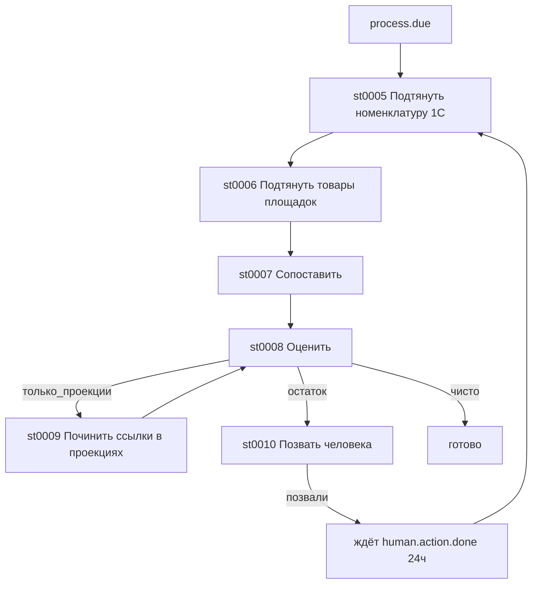

Наброски плана для внедрения ReactFlow в Plagins:

В первую очередь для процессов, потом для всех визуализаций схем и графов.

Контракт китов — поле manifest.client_kits (закрытый список: tables, charts, flow). Нет поля → ["charts", "tables"]. Неизвестное имя — отказ validate.
PluginFrame / srcdoc — в iframe класть только заявленные <script>/<link>. CSS SDK и bootstrap — всегда.
Вендор xyflow — esbuild IIFE (React + ReactDOM + @xyflow/react [+ dagre]) в static/vendor/xyflow/, скрипт сборки в tools/.
Обёртка plugin-flow.js — PluginFlow.render/applyTheme/destroy, без JSX у автора плагина. Тема через --xy-\* ← токены приложения.
Высота iframe — html, body, #plugin-root { height: 100% }, контейнер графа с явной высотой.
Шаблоны агента — graph_template / get_graph_ui_contract, chart_template пишет ["charts"]; навык plugin-authoring.md.
Пилот — hybrid-плагин: сервер отдаёт узлы/рёбра, клиент зовёт PluginFlow.render. Проверка: тема, Restart без утечки, pan/zoom.
Не делать — React в Leptos, CDN, ReactFlow в assets/client_script, allow-same-origin, киты в capabilities.

## Пример Графа Процесса

